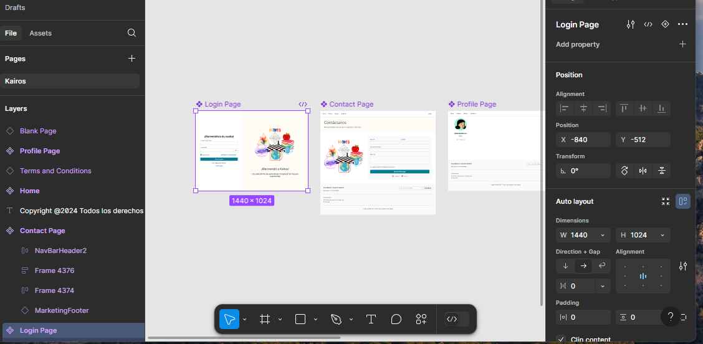
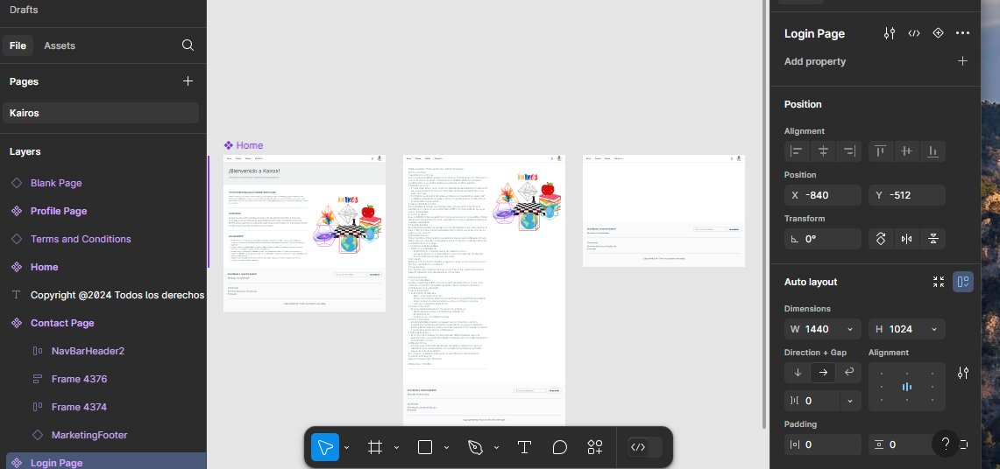
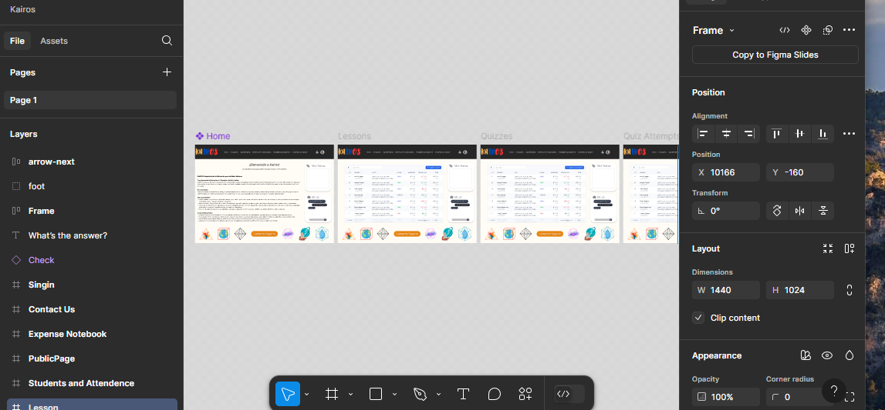
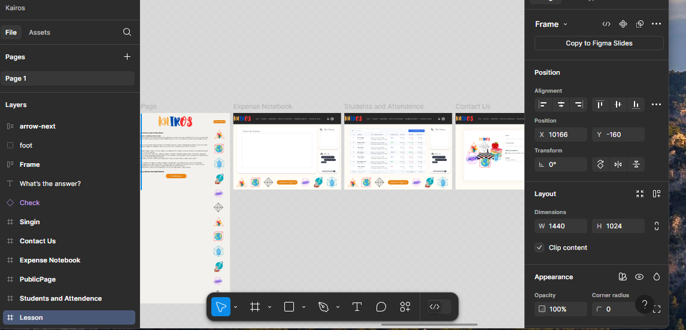

# Figma UI/UX Design Showcase

Welcome to my Figma UI/UX Design Showcase! This repository demonstrates my expertise in utilizing Figma for crafting unique and functional user interface designs. The designs reflect my understanding and application of fundamental UI/UX principles to create visually appealing and user-friendly interfaces.

## About the Project

This project includes a series of UI/UX designs created in Figma. Each design showcases:

- **Clean and Modern Aesthetic**: Following contemporary design trends while ensuring the designs remain timeless.
- **User-Centric Approach**: Prioritizing usability and accessibility for an enhanced user experience.
- **Responsive Design Principles**: Ensuring adaptability across various screen sizes and devices.
- **Attention to Detail**: Focusing on typography, spacing, alignment, and color schemes.

## Key Features

- **Login Page**: A simple and intuitive interface for user authentication.
- **Contact Page**: A functional and visually appealing contact form.
- **Profile Page**: A clean layout showcasing user information.
- **Home Page**: A welcoming landing page with key navigation elements.
- **Interactive Components**: Designed interactive elements that enhance user engagement.

## Screenshots

### Screenshot 1

### Screenshot 2

### Screenshot 3

### Screenshot 4

## Why Choose Figma?

- **Real-Time Collaboration**: Work seamlessly with team members in real-time.
- **Powerful Prototyping**: Easily create and share interactive prototypes.
- **Cloud-Based Platform**: Access your designs anywhere, anytime.

## Learning and Application

Through this project, I honed my skills in:

1. **UI/UX Design Fundamentals**:
   - Wireframing and prototyping
   - Designing for accessibility
   - Visual hierarchy and typography

2. **Figma Tool Expertise**:
   - Utilizing Auto Layout for scalable designs
   - Layer organization and component creation
   - Prototyping and interaction design

3. **Problem-Solving**:
   - Balancing aesthetic and functionality
   - Ensuring responsiveness across devices

## Technologies Used

- **Figma**: Primary tool for design and prototyping.
- **UI/UX Principles**: Applying design theories for an optimal user experience.

## How to View the Designs

1. Clone or download this repository.
2. Open the `figma_design_links.md` file to access the Figma links.
3. Explore the designs and prototypes directly in Figma.

## Feedback

I am constantly looking to improve my skills. If you have any suggestions, ideas, or feedback, feel free to open an issue or contact me directly.

---

Thank you for visiting my Figma UI/UX Design Showcase. I hope this repository highlights my competence and passion for creating effective and beautiful digital experiences.
